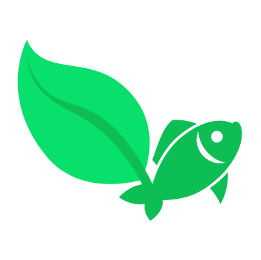
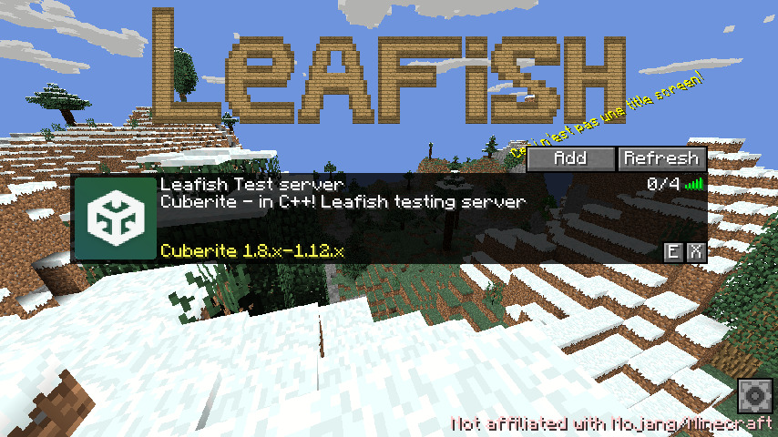

#  Leafish

Multi-version Minecraft-compatible client written in Rust, forked from [Stevenarella](https://github.com/iceiix/stevenarella/).

Installer: https://github.com/Lea-fish/Leafish/releases/tag/v0.0.1-alpha

---



---

### Chat

Chat takes place on Matrix and Discord.
The channels are bridged to each other so you won't need an account on both services.

If you want to help _make_ and _improve_ the game, join the developer room.

If you're a user and need help or want to ask some questions then join the general room.

Announcements are made in the announcement room and joining it is a good way to keep up-to-date with the project.

| General | Development | Announcements |
| ------- | ----------- | ------------- |
| [](https://matrix.to/#/#leafish-general:matrix.org) | [](https://matrix.to/#/#leafish-development:matrix.org) | [](https://matrix.to/#/#leafish-announcements:matrix.org) |
| [](https://discord.gg/YkHCy3f4qt) | [](https://discord.gg/YkHCy3f4qt) | [](https://discord.gg/YkHCy3f4qt) |

Aside from the individual rooms you can also join the [Matrix space](https://matrix.to/#/#leafish:matrix.org) to have all rooms grouped together nicely.

# Contents

- [Introduction](#introduction)
- [Version support](#version-support)
- [Getting the game](#getting-the-game)
- [Contributing](#contributing)
- [Credits](#credits)
- [License](#license)

## Introduction

**Leafish** is an open-source re-implementation of Minecraft.
The game is a open-world sandbox where players explore a blocky, procedurally-generated 3D world with virtually infinite terrain, and may discover and extract raw materials, craft tools and items, and build structures or earthworks.
The game has various game modes including survival mode, in which players must acquire resources to build the world and maintain health, and a creative mode, where players have unlimited resources and access to flight.

Minecraft is originally written by Mojang in Java for PC, but nowadays also has a so-called "Bedrock edition" which has ports to various alternative platforms.
Leafish attempts to provide everything from the Java-edition and tries to be compatible with it so you can join regular servers and play alongside people using the official Java-based clients.
Being written in Rust with support for modern graphic API's like Vulkan means performance improvements and enhancements that are not possible in the original game.
It's also completely community driven!

Note that currently not everything from the original game is supported yet so Leafish can't currently be seen as a fully fledged alternative.
A list of missing features is available on the [issues page](https://github.com/Lea-fish/Leafish/issues).

## Version support

| Symbol | Meaning |
| ------ | ------- |
| ✓      | All features supported |
| -      | Protocol supported (so the client can join servers using the version) but various missing features |

| Game version | Protocol version | Supported? |
| ------------ | ---------------- | ---------- |
| 1.16.5 | 754 | - |
| 1.16.4 | 754 | - |
| 1.16.3 | 753 | - |
| 1.16.2 | 751 | - |
| 1.16.1 | 736 | - |
| 1.16 | 735 | - |
| 1.15.2 | 578 | - |
| 1.15.1 | 575 | - |
| 1.14.4 | 498 | - |
| 1.14.3 | 490 | - |
| 1.14.2 | 485 | - |
| 1.14.1 | 480 | - |
| 1.14 | 477 | - |
| 1.13.2 | 404 | - |
| 1.12.2 | 340 | - |
| 1.11.2 | 316 | - |
| 1.11   | 315 | - |
| 1.10.2 | 210 | - |
| 1.9.2  | 109 | - |
| 1.9    | 107 | - |
| 1.8.9  | 47  | - |
| 1.7.10 | 5   | - |

Leafish is designed to support multiple protocol versions, so that client development is not in lock-step with the server version.
The level of support varies, but the goal is to support major versions from 1.7.10 up to the current latest major version.
Occasionally, snapshots are also supported.

Forge servers are supported on 1.7.10 - 1.12.2 (FML) and 1.13.2 - 1.16.5 (FML2).

Support for older protocols will _not_ be dropped as newer protocols are added.

## Getting the game

### Using the installer

The easiest way to use Leafish is by using the official cross-platform installer: https://github.com/Lea-fish/Leafish/releases/tag/v0.0.1-alpha
It works for Windows, Linux and MacOS and can install into Mojang's official launcher and Prism Launcher.
If you encounter any issues during the installation process, you might want to try using a different java version to run the installer (java 8 should work).

### Downloading a pre-built version

Since there currently is no release yet, pre-built binaries have to be downloaded from Github Actions.
The latest actions can always be seen [here](https://github.com/Lea-fish/Leafish/actions).
Click on a workflow run from the main branch and download the artifact for your platform.

### Building the game

#### Dependencies

Rust stable version 1.53.0 or newer is required.

**Debian/Ubuntu**

As current Debian stable (Bullseye) has a rust version below the required one, you need to either update from an external source, or consider using Debian Testing (Bookworm) for example.  
For Ubuntu you might want to use the -updates repository for your version.
```
# apt install cargo libssl-dev libxcb-shape0-dev libxcb-xfixes0-dev libxkbcommon-dev libgtk-3-dev
```

**Alpine Linux**

You have to enable the community repository for `cargo`.
```
# apk add cargo openssl-dev xcb-util-dev gtk+3.0-dev
```

**Arch Linux and derivates**

```
# pacman -S rust python3 pkgconf openssl xcb-util gtk3
```

#### Building

Make sure you're in the root of the Git repository before running the following commands.

Compile and run:

```sh
$ cargo run --release
```

Just compile:

```sh
$ cargo build --release
```

#### Running

Double-clicking the game should be enough to run Leafish, which will bring up a login screen followed by a server list from which you can select a server.
If nothing happens consider running the executable from the command-line, `./leafish` and see if any errors come up.

## Contributing

A list of bugs and missing features can be found on the [issue tracker](https://github.com/Lea-fish/Leafish/issues/).
Feel free to work on any bug and submit a pull request to the `main` branch with the fix.
Mentioning that you intend to fix a bug on the issue will prevent other people from trying as well and makes sure no duplicated work is done.
Note that all contributions are will be dual-licensed under MIT and ApacheV2

### New features

Please talk to the Leafish team first before starting to develop a new feature.
We first and foremost try to make the game feature complete compared to the vanilla Java edition and except for very specific things these should be prioritized.
Therefor contacting us will allow us to help you or prevent you from wasting any time.
You can talk to us via Matrix and/or Discord, see links at the top of this page.

## Credits

Thanks to [@thinkofname](https://github.com/thinkofname/) for the original [Steven (Rust)](https://github.com/thinkofname/steven) and [@iceiix](https://github.com/iceiix/) for taking up development with [Stevenarella](https://github.com/iceiix/stevenarella/).

## License

Dual-licensed MIT and ApacheV2
